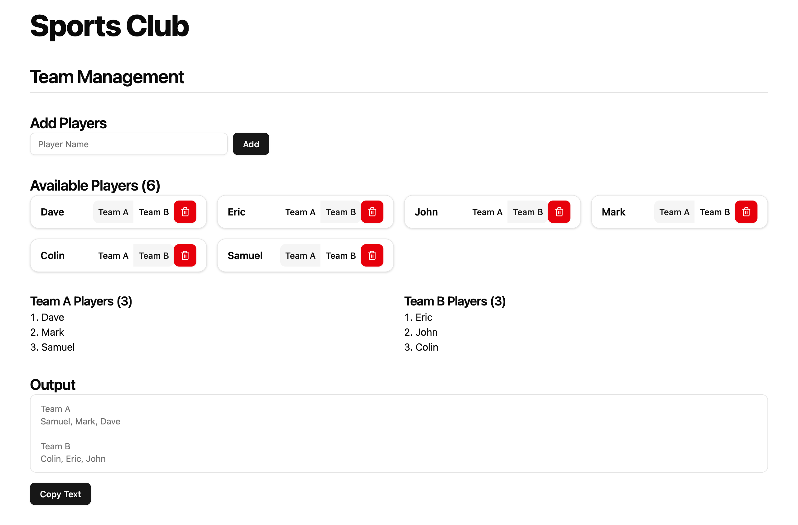

# Sports Team Manager

A sports team manager web application for helping create and manage teams.



1. Add players
2. Assign players to teams
3. Copy shuffled teams lineups to clipboard
4. Share!

## Setup

1. Clone the repository:

```
git clone git@github.com:jakecoombs/sports-team-manager.git
```

2. Create local env files:

```
cp .env.example .env.local
```

3. Update variables in `.env.local`:

```
NEXT_PUBLIC_CLUB_NAME="Sports Club"
NEXT_PUBLIC_TEAM_A="Team A"
NEXT_PUBLIC_TEAM_B="Team B"
```

4. Run the web application:

```
make start-prod
```

## Make Commands

The following make commands are available to manage your development and production environments:

- `make build-dev`: Build the dev Docker image.
- `make start-dev`: Start the dev Docker container.
- `make stop-dev`: Stop the dev Docker container.
- `make build-prod`: Build the prod Docker image.
- `make start-prod`: Start the prod Docker container.
- `make stop-prod`: Stop the prod Docker container.

## Developing the Frontend

If using VSCode, it is recommended that you use the Dev Containers extension to attach to the running dev container after running `make start-dev`.
This way, you are able to manage install npm packages, and run `npm run lint` from the docker container, as well as having the IDE infer the types and packages from the container.
